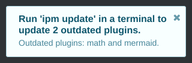

# Update Checker plugin for Inkdrop

[](https://github.com/jmerle/inkdrop-update-checker/actions?query=workflow%3ABuild)
[](https://my.inkdrop.app/plugins/update-checker)
[](https://my.inkdrop.app/plugins/update-checker)
[](https://github.com/jmerle/inkdrop-update-checker/blob/master/LICENSE)

**Since Inkdrop 5.0.0 an update checker is integrated in Inkdrop, so this plugin is no longer required to be notified about plugin updates.**



This plugin automatically checks for Inkdrop plugin updates on launch. A notification is shown if there are updates available.

## Install

```
ipm install update-checker
```

## Changelog

See the [GitHub releases](https://github.com/jmerle/inkdrop-update-checker/releases) for an overview of what changed in each update.

## Contributing

All contributions are welcome. Please read the [Contributing Guide](https://github.com/jmerle/inkdrop-update-checker/blob/master/CONTRIBUTING.md) first as it contains information regarding the tools used by the project and instructions on how to set up a development environment.
